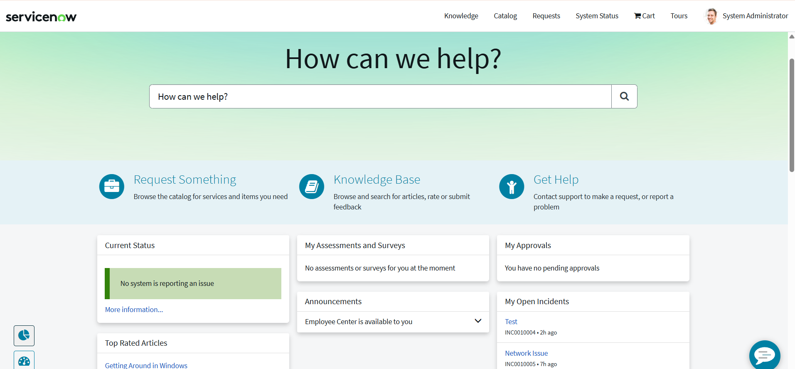
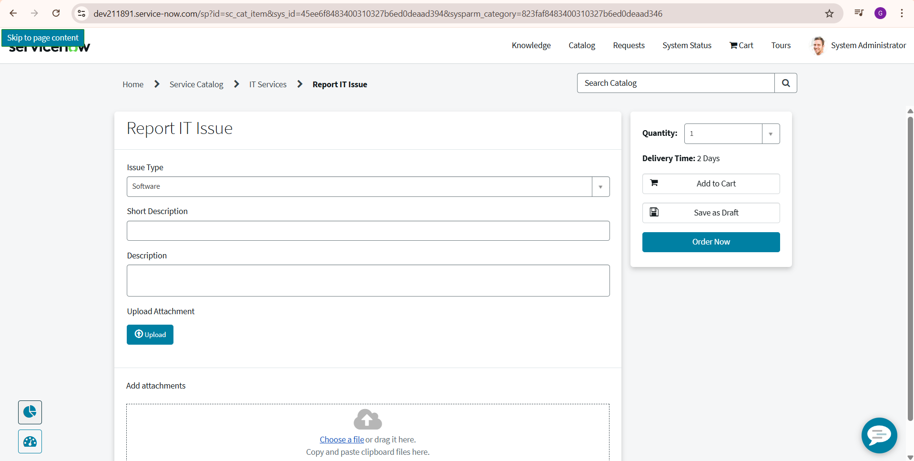
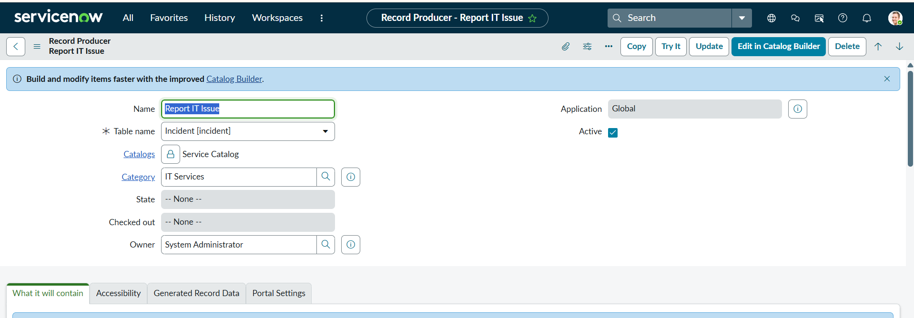
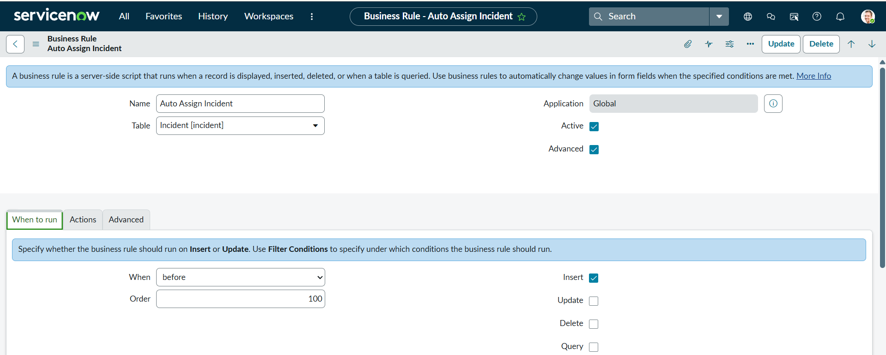
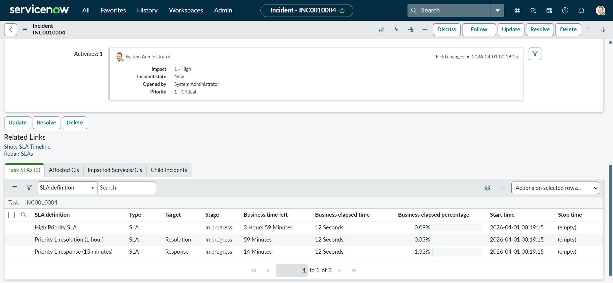
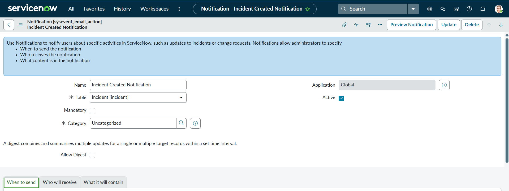
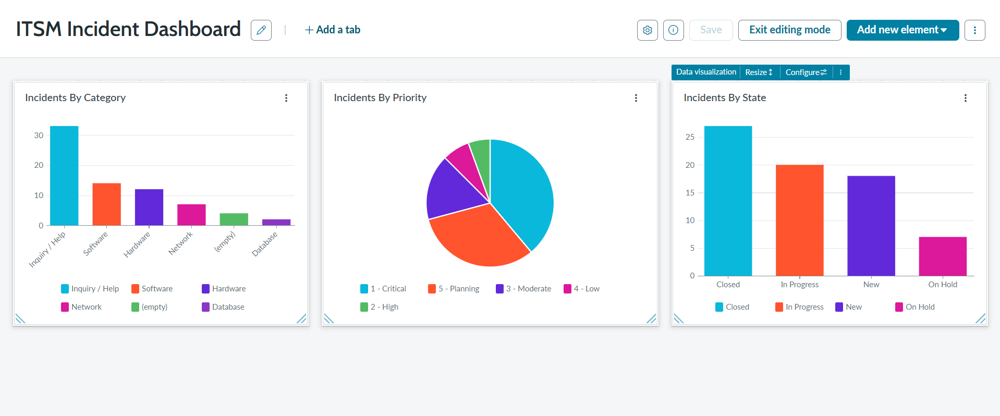

# servicenow-itsm-project
End-to-End ITSM Incident Management in ServiceNow

# ServiceNow ITSM Incident Management Project
## 📌 Overview

This project demonstrates an end-to-end ITSM Incident Management system built using ServiceNow. It covers the complete lifecycle of incident creation, assignment, SLA tracking, notifications, and reporting.

## 🚀 Features Implemented
- 🔹 Service Catalog & Record Producer for incident creation
- 🔹 Business Rule for automatic assignment based on category
- 🔹 SLA configuration for priority-based resolution tracking
- 🔹 Email Notifications for real-time updates
- 🔹 Interactive Dashboard for incident analysis

## 🛠️ Technologies Used
- ServiceNow (Zurich Version)
- JavaScript (Business Rules, Scripts)
- ITSM Module

## 📊 Dashboard Insights
- Incidents categorized by type
- Priority distribution
- Incident state tracking

## 📸 Screenshots
## Service Portal

## Catalog

## Record Producer

## Business Rule

## SLA

## Notification

## Dashboard

